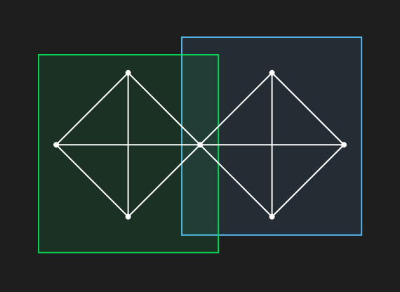
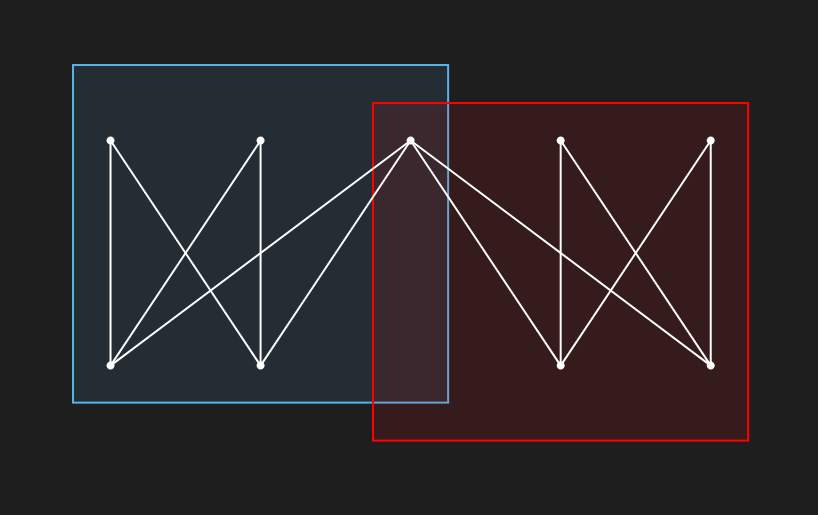
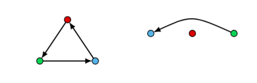

💼 Assistant Professor (ATER in french)

🏫 University of Strasbourg, France

✉️ lucasisenmann (at) unistra.fr

## Research interests

- Planar graphs and intersection graphs
- Order dimension
- Clusters in graphs
- Degreewidth of tournaments
- Distance identifying problems

## Publications

### Submitted Papers

**Correlation Clustering with Overlap: a Heuristic Graph Editing Approach**
(with Faisal N. Abu-Khzam and Sergio Thoumi)
Submitted
[ArXiv Preprint](https://arxiv.org/abs/2412.02704)

**Cluster Editing** consists in adding and deleting edges so that the resulting graph is an union of cliques.
The problem is that this model does not allow data to be contained in several clusters.

We address this latter problem by allowing vertex to be split.
We develop heuristics for this **Cluster Vertex Splitting** problem and compare them to classical algorithms.

### Journal Publications

**Dushnik-Miller dimension of TD-Delaunay complexes**
(with Daniel Gonçalves)
*European Journal on Combinatorics*,
2019
[ArXiv Preprint](https://arxiv.org/abs/1803.09576)

**On the Distance Identifying Set meta-problem and applications to the complexity of identifying problems on graphs**
(with Florian Barbero and Jocelyn Thiebaut)
*Algorithmitica*,
2018
[ArXiv Preprint](https://arxiv.org/abs/1810.03868)

### International conferences

**Bicluster Editing with Overlaps: A Vertex Splitting Approach**
(with Faisal N. Abu-Khzam and Zeina Merchard)
*IWOCA 2025*,
[ArXiv Preprint](https://arxiv.org/abs/2505.03959)
[Conference Slides](slides/BCEVS_iwoca_slides.pdf)

**Bicluster Editing with Overlaps** consists in splitting the vertices of a bipartite graph and deleting or adding edges so that the graph becomes an union of bicliques.

**On the complexity of 2-club Cluster Editing with Vertex Splitting**
(with Faisal N. Abu-Khzam, [Tom Davot](https://www.univ-angers.fr/fr/acces-directs/annuaire-2/d/a/uduser-t-davot-fr.html) and Sergio Thoumi)
*COCOON 2025*,
[ArXiv Preprint](https://arxiv.org/abs/2411.04846)
[Conference Slides](slides/2CCEDVS_COCOON.pdf)

A 2-club is graph with diameter at most 2 (each pair of vertices are at distance at most 2).
**2-Club Cluster Editing with Vertex Splitting** consists in adding and removing edges and split vertices so that the resulting graph is an union of 2-clubs.

**Domination in Diameter-Two Graphs and the 2-Club Vertex Deletion Parameter**
(with Faisal N. Abu-Khzam)
*ITCJS-FAW*,
2025
[ArXiv Preprint](https://arxiv.org/abs/2408.08418)
[Conference Slides](slides/domination_diameter_2_faw_slides.pdf)

We prove that 
- Independent Dominating Set is W2-hard in graphs of diameter at most 2
- 2CCVD parameterized by solution size is FPT

**Degreewidth : a new parameter for solving problems on tournaments**
(with [Tom Davot](https://www.univ-angers.fr/fr/acces-directs/annuaire-2/d/a/uduser-t-davot-fr.html), Sanjukta Roy and Jocelyn Thiebaut)
*WG*,
2023
[ArXiv Preprint](https://arxiv.org/abs/2212.06007)

The **degreewidth** of a tournament is the minimum of the maximum number of backward arcs incident to vertices for every order of the vertices.
We prove
- it is NP-complete to compute it
- DS parameterized by DW is FPT

**Analysis of the Sybil defense of Duniter-based cryptocurrencies**
*FRCSS*,
2021

Duniter is a cryptocurrency wher each user is generating money on a regular basis.
To avoid Sybil attacks (i.e. that malicious users create fake accounts and gain more money), some graph theoritical rules.
We study the limits of these defenses.

**On the approximation hardness of geodetic set and its variants**
(with Tom Davot and Jocelyn Thiebaut)
*COCOON*, 2021
[HAL](https://hal.science/lirmm-03328636v2)

**Dushnik-Miller dimension of stair contact complexes**
(with Daniel Gonçalves)
*EuroComb*, 2019

**Discrete Morse theory for the collapsibility of supremum sections**
(with Balthazar Bauer)
*ICGT*, 2018
[ArXiv Preprint](https://arxiv.org/abs/1803.09577)

**Planar graphs as L-intersection or L-contact graphs**
(with Daniel Gonçalves and Claire Pennarun)
*SODA*, 2018
[ArXiv Preprint](https://arxiv.org/abs/1707.08833)

**Möbius stanchion system**
(with Timothée Pecatte)
*LAGOS*, 2017

### Thesis

**From planar graphs to higher dimension**
PhD Thesis supervised by [Daniel Gonçalves](https://www.lirmm.fr/~goncalves/pmwiki/).
Defended in 2019.
[HAL](https://theses.hal.science/tel-02931761/)

## Softwares

[Gracoon](www.gracoon.com) - An online collaborative graph editor.

[Agreg-maths.fr](www.agreg-maths.fr) - A website collecting ressources for the agregation of mathematics in France.

[PACE 2024](https://github.com/lucas-isenmann/pace24-ocm/tree/final) - An exact solver for the PACE 2024 challenge on the One sided Crossing Minimization problem 

