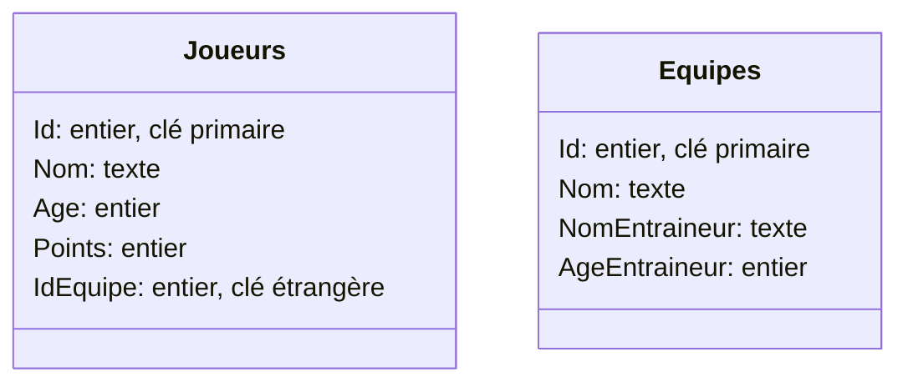
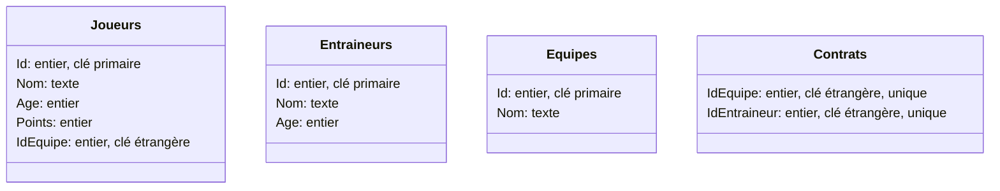

# Partiel - HAS251I - Solutions

Date : 26/05/23. Durée : 1h. Bareme : 18 points.

## Exercice 1 : requetes SQL (14 points)

Sur la base de données `cinema.odb` travaillée en cours, vous utiliserez le logiciel Libre Office Base pour donner des requetes SQL qui répondent aux questions suivantes : (ne pas donner le résultat mais juste la requete)

1. (*2pts*) Quels sont les identifiants des cinémas qui sont dans la ville de `Lyon` ?

```sql solution
SELECT ID From Cinemas
WHERE Ville = 'Lyon'
```

2. (*2pts*) Quels sont les identifiants et les titres des films dont l'année est inférieur ou égal à 2000 ?

```sql solution
SELECT ID,Titre From Films
WHERE Annee <= 2000
```

3. (*2pts*) Combien y a t-il de films dans la base de données ?

```sql solution
SELECT COUNT(*) FROM Films
```

4. (*2pts*) Quelles villes projettent un film le `Samedi` ?

```sql solution
SELECT Ville From Cinemas
JOIN Projections
ON Cinemas.ID = Projections.IdCinema
WHERE Jour = 'Samedi'
```

5. (*2pts*) Combien y a t-il de salles par marque de cinéma ? (Exemple : Gaumont a 40 salles)

```sql solution
SELECT Marque,SUM(NbSalles) From Cinemas
GROUP BY Marque
```

6. (*2pts*) Quels sont les identifiants des films qui sont projetés strictement moins de 3 fois :

```sql solution
SELECT IdFilm
FROM Projections
GROUP BY IdFilm
HAVING COUNT(*) < 3
```

7. (*2pts*) Quels sont les titres des films qui sont projetés dans le cinéma numéro 2 et dont l'année est inférieur ou égal à 2000 ?

```sql solution
SELECT Titre FROM Projections
JOIN Films
ON Projections.IdFilm = Films.ID
WHERE IdCinema = 2 AND Annee <= 2000
```


## Exercice 2 : modélisation (*4 points*)

On désire faire une base de données des équipes, joueurs et entraineurs d'un championnat sportif. On doit stocker les informations suivantes sur :

- les joueurs : le nom, l'age et le nombre de points marqués depuis le début de la compétition
- les équipes : le nom et l'entraineur
- les entraineurs : le nom et l'age

Chaque équipe n'a qu'un seul entraineur mais peut avoir plusieurs joueurs.
Des joueurs ou des entraineurs peuvent ne pas avoir d'équipe.

La base de données doit pouvoir permettre de répondre à ces questions (vous n'avez pas à donner les requetes SQL pour ces questions) :

- quels joueurs sont dans une certaine équipe ?
- combien une certaine équipe a de joueurs ?
- quel équipe entraine un certain entraineur ?
- quel entraineur possède un certain équipe ?
- quel est le nom, l'age des joueurs ou des entraineurs ?

Plusieurs solutions de base de données sont possibles mais il faut donner une solution qui évite les redondances.
Donner les tables (avec leur nom et leurs attributs qui seront soit un nombre soit du texte). Préciser quels attributs jouent le role de clef primaire et de clef étrangère.

---

### Solution 





La solution précédente ne permet cependant pas de facilement déplacer un entraineur d'équipe.
Pour régler ce problème le mieux est de faire une table **Entraineurs** et une table **Contrats**, avec des attributs uniques, pour lier les entraineurs aux équipes de sorte qu'un entraineur ne peut entrainer qu'au plus 1 équipe, et qu'une équipe n'a au plus qu'un entraineur.



